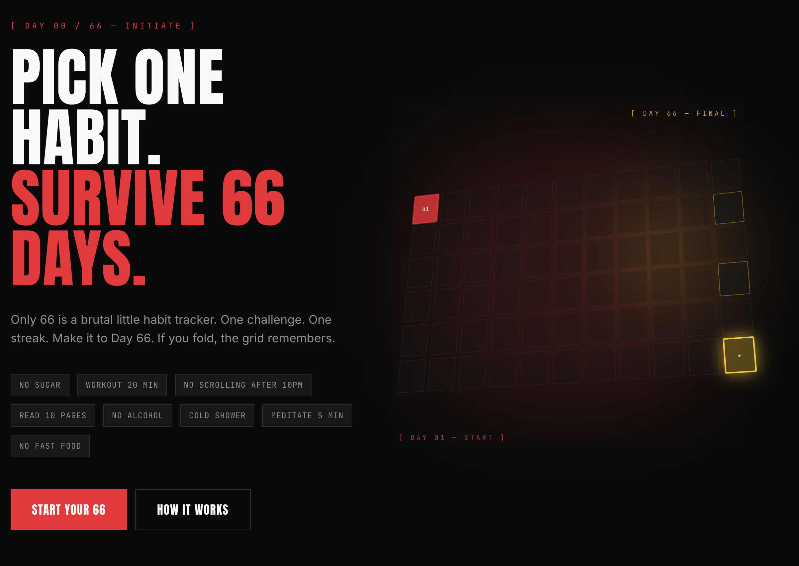
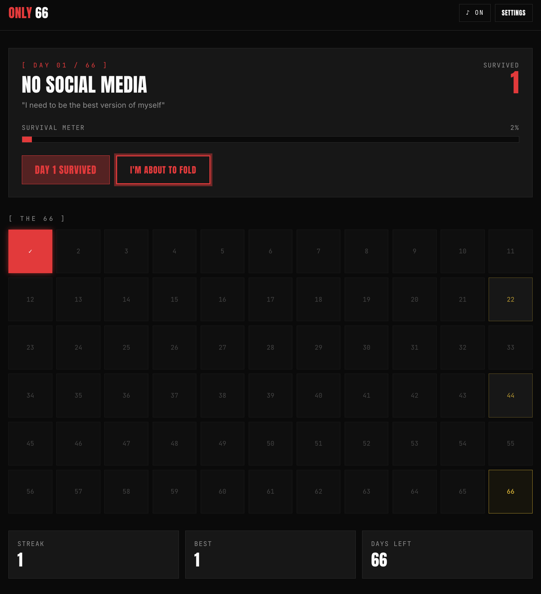

# Only 66 

> A vibe-coded gamified habit tracker built with **Lovable**, **Vercel**, and **Copilot**

Pick one challenge. Protect your streak. Make it to Day 66.


---

## About Only 66

**Only 66** is a gamified habit tracker that helps you build or break a habit in 66 days. 

Inspired by the addictive streak system of apps like Duolingo, Only 66 uses:
- **Progress tracking** — Visual streak counter and daily check-ins
- **Reminders** — Stay on top of your challenge with smart notifications
- **Pressure-based motivation** — The fear of losing your streak keeps you consistent

Pick one habit. Follow through. Don't fold.

---

## Pictures

### Landing Page



### Calendar View



---

## Tech Stack

| Layer | Technology |
|-------|-----------|
| **Framework** | React 19 + TypeScript |
| **Build Tool** | Vite 7 |
| **Router** | TanStack Router 1 |
| **State Management** | TanStack React Query 5 |
| **UI Components** | Radix UI + Shadcn/ui |
| **Styling** | Tailwind CSS 4 + Tailwind Merge |
| **Forms** | React Hook Form + Zod validation |
| **Database** | Supabase (PostgreSQL) |
| **Charts** | Recharts |
| **Notifications** | Sonner toast system |
| **Icons** | Lucide React |
| **Backend Runtime** | Nitro (Full-stack with TanStack Start) |
| **Hosting** | Vercel |
| **Dev Tools** | ESLint, Prettier, TypeScript |

---

## UI Pages

### Public Pages
- **Landing Page** (`/`) — Hero section showcasing the challenge concept with example habits
- **Login** (`/login`) — Authentication page for returning users

### Authenticated Pages
- **Onboarding** (`/_authenticated/onboarding`) — Setup your first 66-day challenge
- **Dashboard** (`/_authenticated/dashboard`) — Main hub showing:
  - Current streak counter
  - Daily check-in interface
  - Progress visualization
  - Settings access
  - Panic button (give up option)
- **Win Page** (`/_authenticated/win`) — Celebrate completing your 66-day challenge

### Key Modals & Components
- **CheckInModal** — Daily habit completion logging
- **PanicModal** — Confirm habit abandonment
- **SettingsSheet** — User preferences and challenge settings
- **SoundToggle** — Audio feedback control

---

## Project Structure

```
only-66-day-streak/
├── src/
│   ├── routes/                    # TanStack Router file-based routes
│   │   ├── __root.tsx            # Root layout with global providers
│   │   ├── index.tsx             # Landing page
│   │   ├── login.tsx             # Login page
│   │   ├── _authenticated.tsx    # Protected routes layout
│   │   └── _authenticated/
│   │       ├── dashboard.tsx     # Main dashboard
│   │       ├── onboarding.tsx    # Challenge setup
│   │       └── win.tsx           # Victory celebration
│   │
│   ├── components/
│   │   ├── ui/                   # Radix UI + Shadcn components
│   │   ├── dashboard/            # Dashboard-specific components
│   │   │   ├── CheckInModal.tsx
│   │   │   ├── PanicModal.tsx
│   │   │   └── SettingsSheet.tsx
│   │   ├── landing/              # Landing page components
│   │   └── SoundToggle.tsx       # Global sound control
│   │
│   ├── hooks/
│   │   └── use-mobile.tsx        # Responsive design hook
│   │
│   ├── lib/
│   │   ├── day-math.ts          # 66-day streak calculations
│   │   ├── storage.ts           # LocalStorage persistence layer
│   │   ├── tone.ts              # Motivation messages & motivational tone
│   │   ├── sound.ts             # Audio management
│   │   ├── error-capture.ts     # Error handling utilities
│   │   ├── config.server.ts     # Server-side configuration
│   │   └── api/                 # Server functions for API calls
│   │
│   ├── integrations/
│   │   ├── supabase/            # Supabase client & auth
│   │   │   ├── client.ts        # Client-side Supabase
│   │   │   ├── client.server.ts # Server-side Supabase
│   │   │   ├── auth-middleware.ts
│   │   │   └── types.ts         # TypeScript types for database
│   │   └── lovable/             # Lovable integration
│   │
│   ├── assets/                   # Static images & SVGs
│   ├── server.ts                # Express/Nitro server setup
│   ├── start.ts                 # App entry point
│   ├── router.tsx               # Router configuration
│   └── styles.css               # Global Tailwind styles
│
├── supabase/
│   ├── config.toml              # Local dev configuration
│   └── migrations/              # Database schema migrations
│
├── public/
│   └── sounds/                  # Audio files for notifications
│
├── vite.config.ts               # Vite build configuration
├── tsconfig.json                # TypeScript configuration
├── tailwind.config.ts           # Tailwind CSS theming
├── eslint.config.js             # Linting rules
├── bunfig.toml                  # Bun package manager config
└── components.json              # Shadcn/ui config

```

---

## Getting Started

### Prerequisites
- Node.js 18+
- Bun or npm/yarn
- Supabase account (for backend)
- Vercel account (for deployment)

### Installation

```bash
# Install dependencies
bun install

# Set up environment variables
cp .env.example .env.local

# Start development server
bun run dev

# Build for production
bun run build
```

### Local Supabase Setup

```bash
# Start local Supabase
supabase start

# Run migrations
supabase migration up
```

---

## How It Works

1. **Create Challenge** — User picks a habit and commits to 66 days
2. **Daily Check-in** — Each day, confirm completion or skip (breaks streak)
3. **Progress Tracking** — See visual feedback, milestones, and encouragement
4. **Win Condition** — Complete all 66 days and celebrate

---

## Deployment

Deploy to Vercel with one click:

```bash
vercel deploy
```

Environment variables are securely managed through Vercel dashboard.

---

## License

MIT — Built using Lovable, Vercel, and Copilot

---

**Only 66** — Proof that you can change anything in 66 days. Or just prove you don't fold.
